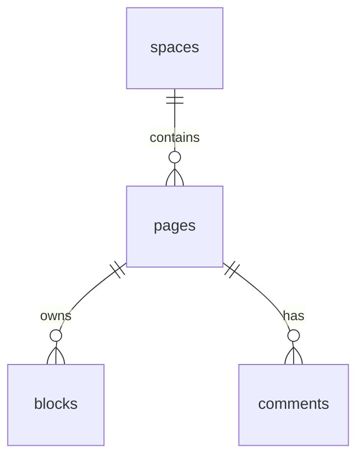

# Data model

## IDs

- UUID v4 strings, canonical lower hex with hyphens.

## `spaces`

| Column     | Type                |
| ---------- | ------------------- |
| id         | uuid pk             |
| tenant_id  | text (from JWT tid) |
| name       | text                |
| created_at | timestamptz         |

## `pages`

| Column                  | Type                       |
| ----------------------- | -------------------------- |
| id                      | uuid pk                    |
| space_id                | uuid fk                    |
| parent_page_id          | uuid nullable              |
| title                   | text                       |
| icon                    | text nullable              |
| archived_at             | timestamptz nullable       |
| sort_order              | double precision default 0 |
| created_at / updated_at | timestamptz                |

## `blocks`

| Column                  | Type                  |
| ----------------------- | --------------------- |
| id                      | uuid pk               |
| page_id                 | uuid fk               |
| parent_block_id         | uuid nullable         |
| type                    | text                  |
| properties              | jsonb                 |
| content                 | jsonb (RichText JSON) |
| sort_order              | double precision      |
| created_at / updated_at | timestamptz           |

## `operations`

| Column     | Type         |
| ---------- | ------------ |
| id         | bigserial pk |
| command_id | uuid         |
| actor_id   | text         |
| actor_type | text         |
| op_type    | text         |
| payload    | jsonb        |
| created_at | timestamptz  |

## `idempotency_keys`

| Column                      | Type        |
| --------------------------- | ----------- |
| actor_id                    | text        |
| key                         | text        |
| result                      | jsonb       |
| created_at                  | timestamptz |
| primary key (actor_id, key) |

## `proposals`

| Column     | Type                           |
| ---------- | ------------------------------ |
| id         | uuid pk                        |
| space_id   | uuid                           |
| actor_id   | text                           |
| status     | enum pending/approved/rejected |
| rationale  | text                           |
| payload    | jsonb (commands)               |
| created_at | timestamptz                    |

## `comments`

| Column     | Type          |
| ---------- | ------------- |
| id         | uuid pk       |
| page_id    | uuid          |
| block_id   | uuid nullable |
| author_id  | text          |
| body       | jsonb         |
| created_at | timestamptz   |

## `yjs_snapshots`

| Column     | Type        |
| ---------- | ----------- |
| page_id    | uuid pk     |
| snapshot   | bytea       |
| updated_at | timestamptz |

## ER (simplified)

